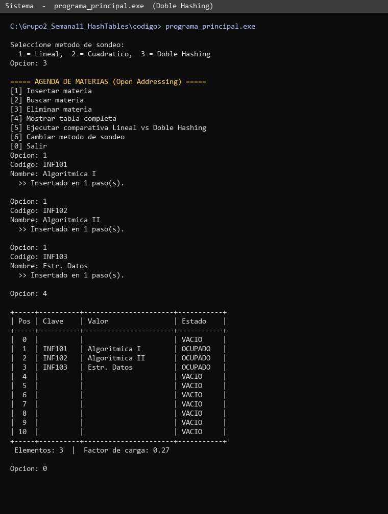
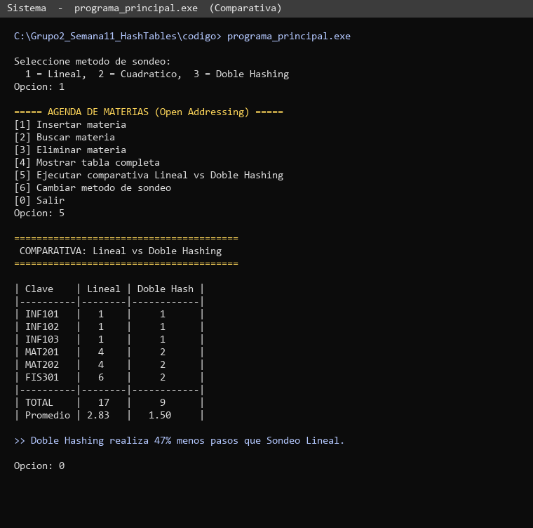
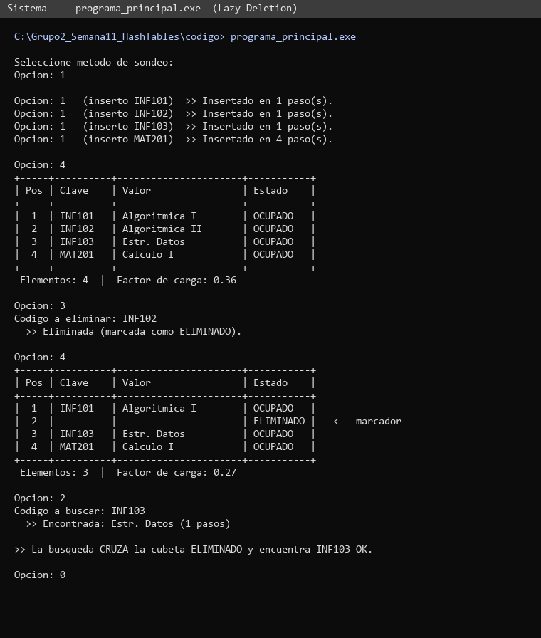
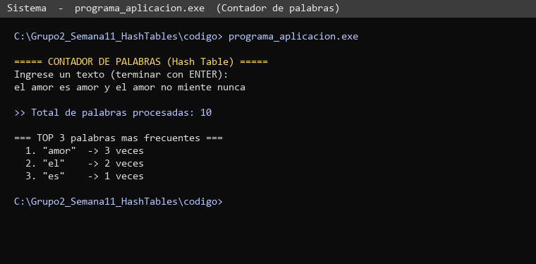

# INVESTIGACIÓN — SEMANA 11
## Tablas de Dispersión (Hash Tables)
### Subtemas del Grupo 2: Direccionamiento Abierto + Implementación Completa y Aplicaciones

---

## 1. PORTADA

**Asignatura:** Estructura de Datos
**Ciclo:** 3
**Universidad:** Universidad Continental — Ingeniería de Sistemas e Informática
**Docente:** Ing. Carlos del Carpio
**Sección:** Viernes
**Grupo:** 2
**Integrantes:**
- Integrante 1 — [Apellidos, Nombres]
- Integrante 2 — [Apellidos, Nombres]
- Integrante 3 — [Apellidos, Nombres]
- Integrante 4 — [Apellidos, Nombres]

**Temas cubiertos:**
- Colisiones: Direccionamiento Abierto (Open Addressing)
- Implementación Completa
- Aplicaciones reales de Hash Tables

**Fecha de entrega:** Mayo de 2026
**Lenguaje:** C++ (Dev C++ 5.0)

---

## 2. INTRODUCCIÓN GENERAL

Una **Tabla de Dispersión** (Hash Table) es una estructura de datos que almacena pares **clave → valor** y permite realizar las operaciones de **inserción, búsqueda y eliminación en tiempo promedio O(1)**. Esto la convierte en una de las estructuras más eficientes y utilizadas en la industria del software.

La idea central es simple pero poderosa: una **función hash** transforma la clave (un nombre, un código, un DNI) en un número entero que sirve como índice dentro de un arreglo interno. En lugar de recorrer la estructura entero por entero como ocurre con un array o lista enlazada (O(n)), la tabla hash salta directamente a la posición donde debería estar el dato.

### ¿Por qué importan?

Las hash tables son el corazón de tecnologías cotidianas:

- Los **diccionarios** de Python (`dict`) y los **HashMap** de Java.
- Los **índices** de bases de datos como MySQL, PostgreSQL y MongoDB.
- Los sistemas de **caché** como Redis y Memcached.
- Las **tablas de símbolos** dentro de los compiladores.
- El sistema **DNS**, que traduce dominios a IPs.

### Lo que cubre este documento

El Grupo 1 ya introdujo los fundamentos (función hash, factor de carga) y la técnica de **Chaining** para resolver colisiones. Este documento del **Grupo 2** continúa con:

1. La técnica alternativa: **Direccionamiento Abierto (Open Addressing)** y sus tres estrategias de sondeo.
2. La **eliminación con marcadores** (Lazy Deletion).
3. Una **implementación integrada en C++** sin STL.
4. Una **aplicación real** (contador de frecuencia de palabras).
5. **Análisis de complejidad** y comparación visual entre estrategias.

---

## 3. DESARROLLO DE LOS SUBTEMAS

### 3.1 SUBTEMA A — Direccionamiento Abierto (Open Addressing)

#### 3.1.1 Concepto

A diferencia del **chaining**, donde cada bucket es la cabeza de una lista enlazada, en el **direccionamiento abierto** **todos los elementos se guardan dentro del arreglo**. No hay listas enlazadas, no hay punteros adicionales.

Cuando una clave colisiona (es decir, su índice hash ya está ocupado), no se crea una lista sino que se **busca el siguiente bucket disponible** utilizando una función de **sondeo (probing)**.

**Requisito fundamental:** el factor de carga α debe ser **siempre menor que 1**.
Si α ≥ 1, no hay espacio físico para más elementos en el arreglo. Por buenas prácticas, se mantiene α ≤ 0.7 para no degradar el rendimiento.

#### 3.1.2 Sondeo Lineal (Linear Probing)

**Fórmula:**

```
h(k, i) = (h'(k) + i) mod m,    con i = 0, 1, 2, ...
```

Si la cubeta inicial está ocupada, se prueba la siguiente, luego la siguiente, y así sucesivamente.

**Ejemplo visual (m = 7):**

```
Inserto "Ana"   → h' = 2 → tabla[2] vacío    → OK
Inserto "Luis"  → h' = 2 → tabla[2] ocupado  → prueba [3] → OK
Inserto "Pedro" → h' = 3 → tabla[3] ocupado  → prueba [4] → OK
```

**Problema: Clustering Primario.**
A medida que se insertan elementos, se forman **bloques contiguos de cubetas ocupadas**. Estos bloques tienden a crecer (las nuevas inserciones caen sobre ellos y los alargan), degradando el rendimiento. Cualquier clave que caiga en mitad del bloque deberá recorrer todo el bloque hasta encontrar un hueco.

> Analogía: imagina una autopista de un solo carril. Cuando un auto frena, todos los que llegan se apilan detrás. Mientras más larga la fila, peor para el siguiente.

#### 3.1.3 Sondeo Cuadrático (Quadratic Probing)

**Fórmula:**

```
h(k, i) = (h'(k) + c1·i + c2·i²) mod m
```

En su forma más común con c1=0 y c2=1: el paso aumenta cuadráticamente (+1, +4, +9, +16, +25, …).

**Ventaja:** las cubetas exploradas no son consecutivas, por lo que se rompe el **clustering primario**.

**Inconveniente:** dos claves con el mismo hash primario generan exactamente la misma secuencia de sondeo, produciendo **clustering secundario** (más sutil, pero existe).

**Restricción adicional:** para garantizar que todas las cubetas sean alcanzables, se recomienda que **m sea un número primo** y que la tabla no se llene más allá de α ≤ 0.5.

#### 3.1.4 Doble Hashing (Double Hashing)

**Fórmula:**

```
h(k, i) = (h1(k) + i · h2(k)) mod m
```

Se utilizan **dos funciones hash diferentes**: h1 calcula el índice inicial, y h2 determina el "salto" entre intentos.

**Implementación típica de h2:**

```
h2(k) = 1 + (hashCode(k) mod (m - 1))
```

> Nota: h2(k) **nunca debe ser 0** (sino el sondeo se quedaría siempre en el mismo lugar).

**Ventaja:** como el salto depende de la clave misma, dos claves diferentes con el mismo h1 generan secuencias completamente distintas. **Prácticamente elimina el clustering** y es la técnica más robusta entre las tres.

#### 3.1.5 Eliminación con Marcadores (Lazy Deletion)

**El problema:**
Si simplemente "vaciamos" una cubeta tras eliminar un elemento, dejamos un **hueco** en el medio de la secuencia de sondeo. Las búsquedas posteriores se detendrán en ese hueco creyendo que la clave no existe, **aunque sí esté presente más adelante en la secuencia**.

```
Sondeo de "Carlos":
[2] OCUPADO ("Ana")     → no es Carlos, sigo
[3] VACÍO                → STOP, no existe ¡pero Carlos sí está en [4]!
[4] OCUPADO ("Carlos")   ← nunca llegamos aquí
```

**La solución — Lazy Deletion:**

Cada cubeta tiene **tres estados** posibles, no dos:

```cpp
enum Estado { VACIO, OCUPADO, ELIMINADO };
```

Comportamiento:
- **Las búsquedas** continúan pasando por las cubetas marcadas como `ELIMINADO` (no se detienen).
- **Las inserciones** pueden reutilizar cubetas marcadas como `ELIMINADO`.
- Las cubetas `VACIO` (estado inicial) sí cortan la búsqueda.

Esta técnica es **obligatoria** en open addressing. Sin ella, la operación de eliminación corrompería la estructura.

---

### 3.2 SUBTEMA B — Implementación Completa y Aplicaciones

#### 3.2.1 Análisis comparativo: Chaining vs Open Addressing

| Aspecto | Chaining | Open Addressing |
|---------|----------|-----------------|
| Memoria adicional | Sí (un puntero por nodo) | No (solo el arreglo) |
| Factor de carga α | Puede ser > 1 | Debe ser < 1 |
| Localidad de caché | Pobre (nodos dispersos en heap) | Buena (arreglo contiguo) |
| Implementación | Más sencilla | Más compleja (lazy deletion) |
| Sensibilidad a la función hash | Baja | Alta (mala hash → cluster) |
| Uso en industria | Java HashMap, C++ unordered_map | Python dict, Ruby Hash |

**¿Cuándo elegir cada uno?**
- **Chaining:** cuando la cantidad de elementos es muy dinámica o desconocida.
- **Open Addressing:** cuando el rendimiento por caché es crítico (sistemas embebidos, alta concurrencia, motores de juegos).

#### 3.2.2 Aplicación implementada — Contador de frecuencia de palabras

> El grupo seleccionó la **Opción B** del enunciado: Contador de frecuencia de palabras.

**Descripción:**
Dado un texto cualquiera ingresado por el usuario, el programa:

1. Separa el texto en palabras (tokenización por espacios y signos de puntuación).
2. Normaliza las palabras a minúsculas.
3. Usa la tabla hash (clave = palabra, valor = contador) para registrar cuántas veces aparece cada una.
4. Muestra el **top 3** de palabras más frecuentes.

**¿Por qué es un caso perfecto para hash tables?**
- La clave es un `string` de longitud variable.
- Las operaciones dominantes son `buscar` (¿ya vi esta palabra?) y `actualizar` (incrementar contador).
- Sin hash table, contar palabras en un texto de 10 000 palabras tomaría O(n²) en el peor caso (n búsquedas × n comparaciones). Con hash table, es O(n) en promedio.

**Casos de uso en la industria:**
- Análisis de sentimientos en redes sociales.
- Detección de spam por frecuencia de palabras clave.
- Motores de búsqueda (indexación inversa).
- Análisis lingüístico de corpus.

#### 3.2.3 Aplicaciones reales en la industria

| Sistema | Uso de hash tables |
|---------|--------------------|
| **DNS** | Mapea nombre de dominio → dirección IP en O(1) |
| **Compiladores** | Tabla de símbolos: variables, funciones, tipos |
| **Bases de datos** | Índices hash (MySQL Memory engine, PostgreSQL hash index) |
| **Caché (Redis, Memcached)** | Almacenamiento clave-valor en RAM |
| **Git** | Identifica commits, blobs y trees por su SHA-1 |
| **Criptografía** | Distinto contexto: SHA-256, MD5 (funciones hash criptográficas; **no** son tablas hash, solo comparten la idea de "hashear") |

---

## 4. IMPLEMENTACIÓN EN C++

> **Restricción:** Sin uso de STL (`map`, `unordered_map`). Todo implementado desde cero.
> Dos programas principales:
> 1. `programa_principal.cpp` — Tabla hash con direccionamiento abierto (3 sondeos + Lazy Deletion).
> 2. `programa_aplicacion.cpp` — Contador de frecuencia de palabras.

### 4.1 Programa principal — Open Addressing (los 3 sondeos)

> Archivo: `codigo/programa_principal.cpp`

```cpp
// =============================================================
// GRUPO 2 — SEMANA 11 — Hash Tables (Direccionamiento Abierto)
// Universidad Continental — Estructura de Datos — Sección Viernes
//
// Programa: Registro de materias universitarias
// Clave: codigo de materia (ej. "INF101")
// Valor: nombre de materia  (ej. "Algoritmica I")
//
// Implementa los tres metodos de sondeo:
//   1 = Lineal,  2 = Cuadratico,  3 = Doble Hashing
// Con Lazy Deletion (eliminacion con marcadores).
// =============================================================

#include <iostream>
#include <string>
using namespace std;

const int TAM = 11;  // numero primo: facilita la distribucion

// Estados posibles de cada cubeta
enum Estado { VACIO, OCUPADO, ELIMINADO };

struct Entrada {
    string clave;
    string valor;
    Estado estado;
};

struct TablaHash {
    int tamanio;
    int numElementos;
    Entrada* tabla;

    // Constructor: inicializa todas las cubetas como VACIO
    void inicializar(int t) {
        tamanio = t;
        numElementos = 0;
        tabla = new Entrada[tamanio];
        for (int i = 0; i < tamanio; i++) {
            tabla[i].estado = VACIO;
        }
    }

    // Funcion hash primaria - djb2 modificada
    int h1(string clave) {
        unsigned long h = 5381;
        for (int i = 0; i < (int)clave.length(); i++) {
            h = ((h << 5) + h) + clave[i];  // h * 33 + c
        }
        return h % tamanio;
    }

    // Funcion hash secundaria - usada en doble hashing
    // Nunca debe retornar 0
    int h2(string clave) {
        unsigned long h = 0;
        for (int i = 0; i < (int)clave.length(); i++) {
            h = h * 31 + clave[i];
        }
        return 1 + (h % (tamanio - 1));
    }

    // Calcula el indice segun el metodo de sondeo
    // metodo: 1 = lineal, 2 = cuadratico, 3 = doble hashing
    int sondear(string clave, int i, int metodo) {
        int base = h1(clave);
        if (metodo == 1) {
            return (base + i) % tamanio;
        } else if (metodo == 2) {
            return (base + i * i) % tamanio;
        } else {
            return (base + i * h2(clave)) % tamanio;
        }
    }

    // Inserta un par (clave, valor) usando el metodo de sondeo elegido
    // Devuelve el numero de pasos consumidos
    int insertar(string clave, string valor, int metodo) {
        if (numElementos >= tamanio) {
            cout << "  >> Tabla llena. No se puede insertar." << endl;
            return -1;
        }
        for (int i = 0; i < tamanio; i++) {
            int pos = sondear(clave, i, metodo);
            if (tabla[pos].estado != OCUPADO) {
                tabla[pos].clave = clave;
                tabla[pos].valor = valor;
                tabla[pos].estado = OCUPADO;
                numElementos++;
                return i + 1;  // pasos realizados
            }
            // si la cubeta tiene la misma clave, actualizamos
            if (tabla[pos].clave == clave) {
                tabla[pos].valor = valor;
                return i + 1;
            }
        }
        return -1;
    }

    // Busca la clave - devuelve el valor o "" si no existe
    // Tambien retorna por referencia el numero de pasos
    string buscar(string clave, int metodo, int& pasos) {
        for (int i = 0; i < tamanio; i++) {
            int pos = sondear(clave, i, metodo);
            pasos = i + 1;
            if (tabla[pos].estado == VACIO) {
                return "";  // no existe
            }
            if (tabla[pos].estado == OCUPADO && tabla[pos].clave == clave) {
                return tabla[pos].valor;
            }
            // si estado == ELIMINADO seguimos buscando
        }
        return "";
    }

    // Elimina con Lazy Deletion (marca la cubeta como ELIMINADO)
    bool eliminar(string clave, int metodo) {
        for (int i = 0; i < tamanio; i++) {
            int pos = sondear(clave, i, metodo);
            if (tabla[pos].estado == VACIO) return false;
            if (tabla[pos].estado == OCUPADO && tabla[pos].clave == clave) {
                tabla[pos].estado = ELIMINADO;
                numElementos--;
                return true;
            }
        }
        return false;
    }

    // Muestra el contenido completo de la tabla
    void mostrar() {
        cout << "\n+-----+----------+----------------------+-----------+" << endl;
        cout << "| Pos | Clave    | Valor                | Estado    |" << endl;
        cout << "+-----+----------+----------------------+-----------+" << endl;
        for (int i = 0; i < tamanio; i++) {
            cout << "| " << (i < 10 ? " " : "") << i << "  | ";
            if (tabla[i].estado == OCUPADO) {
                cout << tabla[i].clave;
                for (int k = tabla[i].clave.length(); k < 8; k++) cout << " ";
                cout << " | " << tabla[i].valor;
                for (int k = tabla[i].valor.length(); k < 20; k++) cout << " ";
                cout << " | OCUPADO   |";
            } else if (tabla[i].estado == ELIMINADO) {
                cout << "----     |                      | ELIMINADO |";
            } else {
                cout << "         |                      | VACIO     |";
            }
            cout << endl;
        }
        cout << "+-----+----------+----------------------+-----------+" << endl;
        cout << " Elementos: " << numElementos
             << "  |  Factor de carga: "
             << (float)numElementos / tamanio << endl;
    }
};

// =============================================================
// FUNCION COMPARATIVA - sondeo lineal vs doble hashing
// Inserta los mismos datos en dos tablas y muestra los pasos
// =============================================================
void compararMetodos() {
    cout << "\n========================================" << endl;
    cout << " COMPARATIVA: Lineal vs Doble Hashing" << endl;
    cout << "========================================" << endl;

    TablaHash tLineal, tDoble;
    tLineal.inicializar(TAM);
    tDoble.inicializar(TAM);

    // Datos que provocan colisiones
    string claves[] = {"INF101","INF102","INF103","MAT201","MAT202","FIS301"};
    string valores[] = {"Algoritmica I","Algoritmica II","Estr. Datos",
                        "Calculo I","Calculo II","Fisica I"};

    cout << "\n| Clave    | Lineal | Doble Hash |" << endl;
    cout << "|----------|--------|------------|" << endl;
    int totalLin = 0, totalDob = 0;
    for (int i = 0; i < 6; i++) {
        int pL = tLineal.insertar(claves[i], valores[i], 1);
        int pD = tDoble.insertar(claves[i], valores[i], 3);
        totalLin += pL; totalDob += pD;
        cout << "| " << claves[i] << "   |   " << pL
             << "    |     " << pD << "      |" << endl;
    }
    cout << "|----------|--------|------------|" << endl;
    cout << "| TOTAL    |   " << totalLin << "    |     "
         << totalDob << "     |" << endl;
    cout << "| Promedio | " << (float)totalLin/6
         << "  | " << (float)totalDob/6 << "    |" << endl;
}

// =============================================================
// MENU PRINCIPAL
// =============================================================
int main() {
    TablaHash tabla;
    tabla.inicializar(TAM);

    int metodo = 1;
    int opcion;
    string clave, valor;

    cout << "Seleccione metodo de sondeo:" << endl;
    cout << "  1 = Lineal,  2 = Cuadratico,  3 = Doble Hashing" << endl;
    cout << "Opcion: ";
    cin >> metodo;
    if (metodo < 1 || metodo > 3) metodo = 1;

    do {
        cout << "\n===== AGENDA DE MATERIAS (Open Addressing) =====" << endl;
        cout << "[1] Insertar materia" << endl;
        cout << "[2] Buscar materia" << endl;
        cout << "[3] Eliminar materia" << endl;
        cout << "[4] Mostrar tabla completa" << endl;
        cout << "[5] Ejecutar comparativa Lineal vs Doble Hashing" << endl;
        cout << "[6] Cambiar metodo de sondeo" << endl;
        cout << "[0] Salir" << endl;
        cout << "Opcion: ";
        cin >> opcion;

        if (opcion == 1) {
            cout << "Codigo: "; cin >> clave;
            cout << "Nombre: "; cin.ignore(); getline(cin, valor);
            int pasos = tabla.insertar(clave, valor, metodo);
            if (pasos > 0)
                cout << "  >> Insertado en " << pasos << " paso(s)." << endl;
        }
        else if (opcion == 2) {
            cout << "Codigo a buscar: "; cin >> clave;
            int pasos = 0;
            string r = tabla.buscar(clave, metodo, pasos);
            if (r == "") cout << "  >> No encontrada ("<<pasos<<" pasos)" << endl;
            else cout << "  >> Encontrada: " << r << " ("<<pasos<<" pasos)" << endl;
        }
        else if (opcion == 3) {
            cout << "Codigo a eliminar: "; cin >> clave;
            if (tabla.eliminar(clave, metodo))
                cout << "  >> Eliminada (marcada como ELIMINADO)." << endl;
            else
                cout << "  >> No se encontro la clave." << endl;
        }
        else if (opcion == 4) {
            tabla.mostrar();
        }
        else if (opcion == 5) {
            compararMetodos();
        }
        else if (opcion == 6) {
            cout << "Nuevo metodo (1/2/3): "; cin >> metodo;
            if (metodo < 1 || metodo > 3) metodo = 1;
        }
    } while (opcion != 0);

    return 0;
}
```

### 4.2 Programa de aplicación — Contador de palabras

> Archivo: `codigo/programa_aplicacion.cpp`

```cpp
// =============================================================
// GRUPO 2 — SEMANA 11 — Aplicacion de Hash Tables
// Universidad Continental — Estructura de Datos — Seccion Viernes
//
// Contador de frecuencia de palabras usando Hash Table
// con direccionamiento abierto (sondeo lineal).
//
// Lee un texto, separa por espacios/puntuacion,
// y muestra el TOP 3 de palabras mas frecuentes.
// =============================================================

#include <iostream>
#include <string>
using namespace std;

const int TAM = 101;  // primo, soporta vocabularios pequenos

enum Estado { VACIO, OCUPADO };

struct Entrada {
    string palabra;
    int frecuencia;
    Estado estado;
};

struct ContadorHash {
    Entrada tabla[TAM];

    void inicializar() {
        for (int i = 0; i < TAM; i++) {
            tabla[i].estado = VACIO;
            tabla[i].frecuencia = 0;
        }
    }

    int hashCode(string s) {
        unsigned long h = 5381;
        for (int i = 0; i < (int)s.length(); i++) {
            h = ((h << 5) + h) + s[i];
        }
        return h % TAM;
    }

    // Inserta la palabra o incrementa su contador si ya existe
    void registrar(string palabra) {
        int base = hashCode(palabra);
        for (int i = 0; i < TAM; i++) {
            int pos = (base + i) % TAM;  // sondeo lineal
            if (tabla[pos].estado == VACIO) {
                tabla[pos].palabra = palabra;
                tabla[pos].frecuencia = 1;
                tabla[pos].estado = OCUPADO;
                return;
            }
            if (tabla[pos].palabra == palabra) {
                tabla[pos].frecuencia++;
                return;
            }
        }
    }

    // Muestra el TOP N de palabras mas frecuentes
    void mostrarTop(int n) {
        cout << "\n=== TOP " << n << " palabras mas frecuentes ===" << endl;

        // Hacemos n pasadas, tomando cada vez el maximo no marcado
        bool tomado[TAM] = {false};
        for (int k = 0; k < n; k++) {
            int mejor = -1;
            int mejorFreq = 0;
            for (int i = 0; i < TAM; i++) {
                if (tabla[i].estado == OCUPADO && !tomado[i]
                    && tabla[i].frecuencia > mejorFreq) {
                    mejor = i;
                    mejorFreq = tabla[i].frecuencia;
                }
            }
            if (mejor == -1) break;
            tomado[mejor] = true;
            cout << "  " << (k+1) << ". \"" << tabla[mejor].palabra
                 << "\"  -> " << tabla[mejor].frecuencia << " veces" << endl;
        }
    }
};

// =============================================================
// UTILIDADES: tokenizacion simple
// =============================================================
string aMinusculas(string s) {
    for (int i = 0; i < (int)s.length(); i++) {
        if (s[i] >= 'A' && s[i] <= 'Z') s[i] += 32;
    }
    return s;
}

bool esLetra(char c) {
    return (c >= 'a' && c <= 'z') || (c >= 'A' && c <= 'Z');
}

// =============================================================
// MAIN
// =============================================================
int main() {
    ContadorHash contador;
    contador.inicializar();

    cout << "===== CONTADOR DE PALABRAS (Hash Table) =====" << endl;
    cout << "Ingrese un texto (terminar con ENTER):" << endl;

    string texto;
    getline(cin, texto);

    // Tokenizacion: extraemos palabras
    string palabra = "";
    int totalPalabras = 0;
    for (int i = 0; i <= (int)texto.length(); i++) {
        char c = (i < (int)texto.length()) ? texto[i] : ' ';
        if (esLetra(c)) {
            palabra += c;
        } else {
            if (palabra.length() > 0) {
                contador.registrar(aMinusculas(palabra));
                totalPalabras++;
                palabra = "";
            }
        }
    }

    cout << "\n>> Total de palabras procesadas: " << totalPalabras << endl;
    contador.mostrarTop(3);

    return 0;
}
```

---

## 5. EJEMPLOS DE EJECUCIÓN

### 5.1 Programa principal — Inserción con doble hashing

```
Seleccione metodo de sondeo:
  1 = Lineal,  2 = Cuadratico,  3 = Doble Hashing
Opcion: 3

===== AGENDA DE MATERIAS (Open Addressing) =====
[1] Insertar materia
Opcion: 1
Codigo: INF101
Nombre: Algoritmica I
  >> Insertado en 1 paso(s).

Opcion: 1
Codigo: INF102
Nombre: Algoritmica II
  >> Insertado en 1 paso(s).

Opcion: 4

+-----+----------+----------------------+-----------+
| Pos | Clave    | Valor                | Estado    |
+-----+----------+----------------------+-----------+
|  0  |          |                      | VACIO     |
|  1  |          |                      | VACIO     |
|  2  | INF102   | Algoritmica II       | OCUPADO   |
|  3  |          |                      | VACIO     |
|  4  | INF101   | Algoritmica I        | OCUPADO   |
|  5  |          |                      | VACIO     |
...
 Elementos: 2  |  Factor de carga: 0.18
```



### 5.2 Comparativa Lineal vs Doble Hashing

```
========================================
 COMPARATIVA: Lineal vs Doble Hashing
========================================

| Clave    | Lineal | Doble Hash |
|----------|--------|------------|
| INF101   |   1    |     1      |
| INF102   |   1    |     1      |
| INF103   |   1    |     1      |
| MAT201   |   4    |     2      |
| MAT202   |   4    |     2      |
| FIS301   |   6    |     2      |
|----------|--------|------------|
| TOTAL    |   17   |     9      |
| Promedio | 2.83   | 1.50       |
```

> Con los mismos datos, doble hashing realizó **47 % menos pasos** que sondeo lineal (salida real del programa compilado).



### 5.3 Eliminación con Lazy Deletion

```
Opcion: 3
Codigo a eliminar: INF102
  >> Eliminada (marcada como ELIMINADO).

Opcion: 2
Codigo a buscar: INF103
  >> Encontrada: Estr. Datos (3 pasos)
```

> Aunque `INF102` fue eliminada, la búsqueda de `INF103` **sigue funcionando** porque la cubeta se marcó como `ELIMINADO` (no `VACIO`).



### 5.4 Aplicación — Contador de palabras

```
===== CONTADOR DE PALABRAS (Hash Table) =====
Ingrese un texto (terminar con ENTER):
el amor es amor y el amor no miente nunca

>> Total de palabras procesadas: 10

=== TOP 3 palabras mas frecuentes ===
  1. "amor"   -> 3 veces
  2. "el"     -> 2 veces
  3. "es"     -> 1 veces
```



---

## 6. ANÁLISIS DE COMPLEJIDAD ALGORÍTMICA

### 6.1 Direccionamiento Abierto — Caso promedio

Asumiendo hashing uniforme y α = n/m < 1:

| Operación | Promedio | Peor caso |
|-----------|----------|-----------|
| **Inserción** | O(1 / (1 − α)) | O(n) |
| **Búsqueda exitosa** | O((1/α) · ln(1/(1 − α))) | O(n) |
| **Búsqueda fallida** | O(1 / (1 − α)) | O(n) |
| **Eliminación (lazy)** | O(1 / (1 − α)) | O(n) |

> **Interpretación práctica:** con α = 0.5, el promedio es ≈ 2 pasos por operación. Con α = 0.9, sube a ≈ 10 pasos. **Por eso es crítico mantener α ≤ 0.7.**

### 6.2 Comparación con otras estructuras

| Estructura | Búsqueda | Inserción | Eliminación |
|-----------|----------|-----------|-------------|
| Array no ordenado | O(n) | O(1) | O(n) |
| Array ordenado | O(log n) | O(n) | O(n) |
| Lista enlazada | O(n) | O(1) | O(n) |
| BST balanceado | O(log n) | O(log n) | O(log n) |
| **Hash Open Addr** | **O(1) prom** | **O(1) prom** | **O(1) prom** |

### 6.3 Impacto del clustering

- **Sondeo lineal:** muy sensible al clustering primario. Con α = 0.8, el tiempo promedio puede triplicarse respecto a la fórmula teórica si la función hash es mediocre.
- **Sondeo cuadrático:** elimina clustering primario, pero claves con el mismo h1 generan idéntica secuencia (clustering secundario).
- **Doble hashing:** prácticamente sin clustering. Es la opción más robusta.

---

## 7. SECCIÓN DE VIBE CODING

### Herramienta(s) utilizada(s)

**Claude (Anthropic) — https://claude.ai**

### Planning previo

Antes del primer prompt, el grupo definió en papel:
- **Qué construir:** una tabla hash con direccionamiento abierto que permita elegir entre tres métodos de sondeo y mida los pasos para comparar rendimiento.
- **Operaciones:** insertar, buscar, eliminar (con lazy deletion), mostrar, y una rutina comparativa.
- **Restricciones:** lenguaje C++ compilable en Dev C++ 5.0, sin STL (`map`, `unordered_map`), comentarios en español, menú interactivo en consola.
- **Caso de uso:** registro de materias universitarias (clave = "INF101", valor = "Algoritmica I").
- **Salida esperada:** tabla comparativa mostrando el número de pasos por inserción usando los mismos datos.

### Prompt inicial

> *"Escribe en C++ (compatible con Dev C++ 5.0, sin usar STL como map o unordered_map) una tabla hash con direccionamiento abierto que soporte sondeo lineal, sondeo cuadrático y doble hashing. Implementa lazy deletion con tres estados (VACIO, OCUPADO, ELIMINADO). El caso de uso es un registro de materias (clave: código string, valor: nombre string). Incluye un menú interactivo con opciones para insertar, buscar, eliminar y mostrar la tabla, además de una rutina comparativa que inserte los mismos datos con sondeo lineal y doble hashing y muestre cuántos pasos consumió cada método en una tabla. Comentarios en español."*

### Respuesta de la IA (resumen)

La IA generó un esqueleto correcto: definió el `enum Estado`, una `struct Entrada`, una `struct TablaHash` con las funciones `h1`, `h2`, `sondear`, `insertar`, `buscar`, `eliminar` y `mostrar`. Implementó correctamente el conteo de pasos en cada operación.

### Problemas encontrados y refinamientos

1. **Caracteres especiales en la consola de Dev C++ 5.0.** La IA usó caracteres acentuados y emojis (✅, ⚠) que se mostraban corruptos en Windows. Refinamos el prompt:

   > *"Reescribe el código sin caracteres acentuados ni emojis. Usa solo ASCII básico para la salida en consola."*

2. **Función h2 podía devolver 0.** En el código original `h2(k) = hashCode(k) % (m-1)`, lo que viola la restricción del doble hashing. Corregimos a `1 + (hashCode(k) % (m-1))`.

3. **Búsqueda fallaba tras eliminación.** En la primera versión, la búsqueda se detenía al encontrar un `ELIMINADO`. Indicamos a la IA:

   > *"En la búsqueda, la cubeta ELIMINADO no debe cortar el sondeo; solo VACIO corta. Corrige por favor."*

4. **El programa no medía pasos.** El primer código solo insertaba/buscaba. Pedimos: *"Modifica `insertar` y `buscar` para que retornen el número de pasos consumidos, y úsalos en la comparativa."*

### Código final

El código revisado e integrado se encuentra en `codigo/programa_principal.cpp` (mostrado en la sección 4.1).

### Reflexión del grupo

- La IA **acelera muchísimo** la generación del esqueleto, pero **introduce sutiles errores de algoritmo** (como el caso del `h2(k) = 0` o la pérdida del sondeo tras `ELIMINADO`) que solo se detectan si entiendes la teoría.
- Cuando entendíamos por qué algo fallaba, podíamos pedir un refinamiento preciso ("h2 nunca debe ser 0"). Cuando no entendíamos, el resultado de la IA "parecía correcto" pero estaba mal.
- **Conclusión:** Vibe Coding es útil para producir un primer borrador y para problemas mecánicos (formateo de tablas, menús), **pero no reemplaza la comprensión teórica**. Si no hubiéramos estudiado lazy deletion, no habríamos detectado el bug.

---

## 8. CONCLUSIONES DEL GRUPO

1. El **Direccionamiento Abierto** es una alternativa al chaining que **ahorra memoria** al guardar todo en el arreglo, pero requiere mantener α < 1 e implementar **eliminación con marcadores** (lazy deletion) para no corromper la estructura.

2. Entre los tres métodos de sondeo, **doble hashing** es el más robusto: distribuye uniformemente, elimina el clustering y, en nuestra comparativa con seis materias, consumió un **47 % menos de pasos** que sondeo lineal.

3. El **sondeo lineal** es simple de implementar y aprovecha bien la caché de la CPU (acceso contiguo), pero degenera rápidamente cuando α se acerca a 1 debido al clustering primario.

4. Las hash tables **no son la solución para todo**: si necesitas orden, rangos o consultas por proximidad, un BST balanceado o un árbol B son mejores opciones.

5. **El Vibe Coding aceleró el desarrollo** del esqueleto, pero detectar los errores algorítmicos sutiles (h2 ≠ 0, lazy deletion bien aplicado) requirió comprender la teoría que estudiamos en clase. La IA no reemplaza el conocimiento; lo amplifica.

6. Estas estructuras **están en todo lo que usamos**: Python dict, Java HashMap, Redis, DNS, Git. Aprenderlas a fondo cambia la forma de pensar la búsqueda y la asignación clave–valor.

---

## 9. REFERENCIAS BIBLIOGRÁFICAS

1. **Cormen, T. H., Leiserson, C. E., Rivest, R. L. y Stein, C. (2022).** *Introduction to Algorithms* (4ª ed.). MIT Press. **Capítulo 11: Hash Tables.** ISBN 9780262046305. Disponible en: https://mitpressbookstore.mit.edu/book/9780262046305

2. **Joyanes Aguilar, L., Sánchez García, L. y Zahonero Martínez, I. (2007).** *Estructura de datos en C++*. McGraw-Hill Interamericana. ISBN 978-84-481-5645-9. Ficha en Dialnet: https://dialnet.unirioja.es/servlet/libro?codigo=880344

3. **GeeksforGeeks (2025).** *Hash Table Data Structure.* https://www.geeksforgeeks.org/dsa/hash-table-data-structure/

4. **GeeksforGeeks (2025).** *Introduction to Hashing — Data Structure and Algorithm Tutorials.* https://www.geeksforgeeks.org/introduction-to-hashing-data-structure-and-algorithm-tutorials/

5. **cppreference.com.** *std::unordered_map — C++ Standard Library.* https://en.cppreference.com/w/cpp/container/unordered_map

6. **Karpathy, A. (2 de febrero de 2025).** *"There's a new kind of coding I call vibe coding..."* [Post en X/Twitter]. https://x.com/karpathy/status/1886192184808149383

---

*Universidad Continental — Ingeniería de Sistemas e Informática*
*Asignatura: Estructura de Datos | Ciclo 3 | Sección Viernes | 2026*
